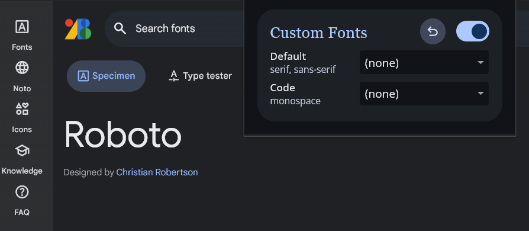
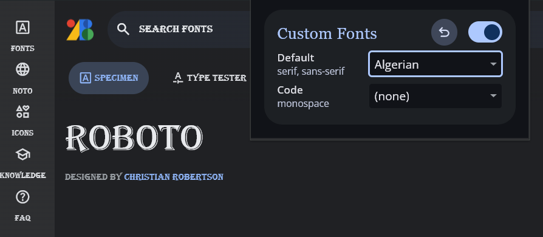

# Font Customizer

_Force the use of custom fonts for web pages._

## Why I created it?

Some web pages use bad or unreadable fonts, I created this extension because I wanted to have more control over the fonts that I see on the web.

## Why is my solution better than others?

- Respects monospaced fonts
- Respects iconic fonts (eg., "Font Awesome", "Material Icons")
- No dependencies
- Small content script bundle size (~ 3.49 kB │ gzip: 1.57 kB)
- Works very fast

## How to install?

1. Download zip file from releases
2. Open [chrome://extensions](chrome://extensions) page and enable **Developer mode**
3. Drag & Drop zip file to extensions page

## How to use it?

Click on the extension icon to open the settings, then select the default font from the drop-down list. This will instantly update fonts for active tab and save preference for other web pages (refresh inactive tabs to see the changes).

If you switch to disabled this is disable font replacement only for current tab.

| Before                                   | After                                   |
| ---------------------------------------- | --------------------------------------- |
|  |  |
