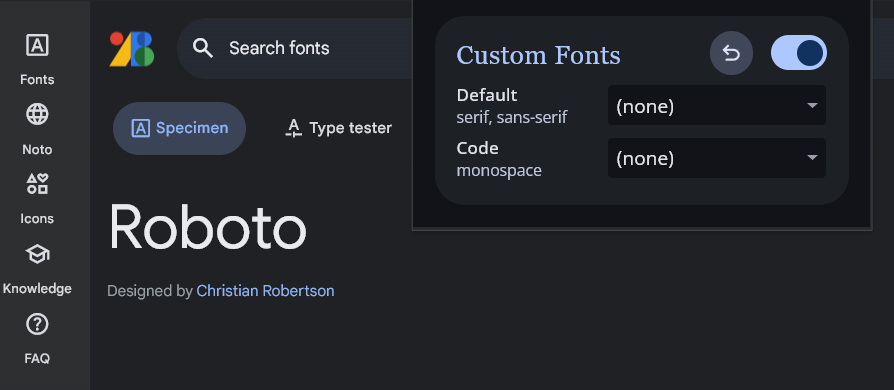
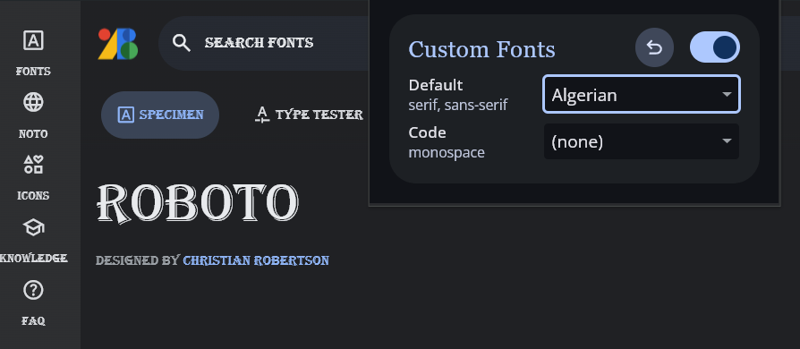

# Font Customizer

_Force the use of custom fonts for web pages._

## Why I created it?

Some web pages use bad or unreadable fonts, I created this extension because I wanted to have more control over the fonts that I see on the web.

## Why is my solution better than others?

- Respects monospaced fonts
- Respects iconic fonts (eg., "Font Awesome", "Material Icons")
- No dependencies
- Small content script bundle size (~ 5 kB │ gzip: 2 kB)
- Works very fast

## How to install?

1. Download zip file from releases
2. Open [chrome://extensions](chrome://extensions) page and enable **Developer mode**
3. Drag & Drop zip file to extensions page

## How to use it?

Click on the extension icon to open the settings and select a default font from the drop-down list to instantly update it.

| Before                                        | After                                        |
| --------------------------------------------- | -------------------------------------------- |
|  |  |

## Features

### Extended font list

The list by default displays locally installed fonts, but extended with popular [Google Fonts](https://fonts.google.com/). If you don't have a local font installed, the extension fetches it from [Google Fonts](https://fonts.google.com/).

### Advanced mode

Enable **Advanced mode** checkbox to swap between two fonts for comparison.

### Functionality

The extension collects CSS selectors and variables responsible for font families from websites, replaces them with custom values, and injects them as a single style tag in one DOM operation. This method improves performance over using observers and hard-coding selector replacements, which are ineffective with dynamically changing DOM content.

## Build and Development

### Prerequisites

- [Visual Studio Code](https://code.visualstudio.com/) (Optional)
- [NodeJS](https://nodejs.org/en/download)
- [pnpm](https://pnpm.io/installation)
- Browser

To start development mode, run the following command, then open [chrome://extensions](chrome://extensions), enable "Developer mode" click "Load Unpacked" and select the build folder:

```git
pnpm dev
```

Build command:

```git
pnpm build
```

Build and pack extension into a zip file:

```git
pnpm zip
```
